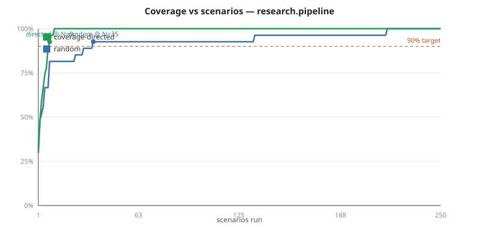

# Manifold

> **Functional coverage and constrained-random verification for AI agents.**

Hardware verification has a mature answer to "did you test enough?" — constrained-random
stimulus + functional coverage (UVM). The agent world doesn't. Manifold brings that
discipline to tool-using AI agents: define a behavior space, generate seeded scenarios
with fault injection, **measure how much of that space you've actually exercised**, and
systematically hunt reliability bugs — handing back the exact seed to reproduce each one.

Point it at an agent, and one screen tells the whole story: coverage %, where the holes
are, the bugs found, and a one-line `manifold repro <seed>` for each.

> Coverage is evidence of thoroughness, not a proof of correctness. Manifold does
> coverage + falsification — it finds bugs and measures how much of the behavior space
> you've covered.

## The artifact — coverage-directed generation decisively beats random



On the multi-tool `research.pipeline` example (a 26-bin behavior space), biasing generation
toward the coverage holes reaches **90% of achievable coverage at N=8 scenarios and *full*
100% coverage at N=11; uniform random needs N=35 for 90% and N=217 for 100%** — roughly
**4× fewer scenarios to 90% and ~20× fewer to full coverage** (at the default seed). Both
modes reach 100% eventually — the example is fair; directed just **targets the behaviors it
hasn't tested** (via input-derived projections) instead of waiting to stumble on them.
Reproduce it in one command:

```bash
manifold curve examples/research_agent.py --agent research.pipeline --svg docs/coverage_curve.svg
```

That is the whole thesis in one picture: *targeting what you haven't tested finds the gaps
faster than testing at random.*

## The catch — a real bug, in an agent we didn't write

Three agents built on **third-party frameworks** — LangGraph's prebuilt ReAct agent,
HuggingFace smolagents' `ToolCallingAgent`, and pydantic-ai's `Agent` — same live model
(`claude-haiku-4-5`), same tasks, same fault space, judged by the full 7-check invariant
library. 15 scenarios × 2 repeats each ([full output](docs/wild_hunt.txt)):

| Framework | Verdict | Coverage |
|---|---|---|
| LangGraph | **15/15 pass** — recovers from every injected fault | 64% |
| pydantic-ai | **15/15 pass** — gives up cleanly, answers from knowledge | ~70% |
| smolagents | **fails ~4–6 of 15 (several flaky)** | 84% |

LangGraph and pydantic-ai pass every seed on every run; smolagents fails a handful — and the
exact set shifts run to run (this is a live, nondeterministic model, so a few seeds land
1/2 across repeats). **That variance is not noise — it's the `pass^k` signal**, the thing
the flakiness machinery exists to surface. On seed `0x7` (persistent `search` outage) the
smolagents agent **retried the dead tool 5× consecutively — rephrasing the query each time —
and burned its entire 12-step budget** (`no_infinite_retry` + `terminates_within_budget`
both fail; the committed live trace is
[`examples/recorded/wild_smolagents_retry.jsonl`](examples/recorded/wild_smolagents_retry.jsonl)).
Another seed caught the model issuing the **identical `fetch` call 4–5×** — the non-consecutive
loop the `no_duplicate_identical_calls` check exists for.

*(The seventh check, `no_unhedged_answer_on_tool_failure` — "never confidently answer when
every tool failed, without acknowledging it" — did **not** fire in the hunt: these agents
either grounded successfully, died on budget, or acknowledged their failures gracefully.
It's a heuristic check for grounded/RAG agents that confabulate; the honest outcome here is
that Haiku doesn't confabulate in these harnesses. Included because it closes the last
concrete gap the review named, not because it caught something.)*

The comparative result is the finding: **the same model that gives up gracefully after ~2
retries in LangGraph, pydantic-ai, and a raw `anthropic` loop retry-storms inside
smolagents** — whose design feeds every tool error back with *"Now let's retry: take care
not to repeat previous errors!"* and forces a tool call on every step
(`tool_choice='required'`). That interaction, not any code we planted, produces the
failures — and it's flaky (~1/2 runs), which is exactly what the `pass^k` repeats machinery
is for. Reproduce: `manifold repro 7 examples/wild_agents.py --agent wild.smolagents`
(live key needed; run it a couple of times — flakiness is the point).

*Is the comparison fair?* Each adapter keeps its framework's own error-handling / retry /
step defaults, surfaces `ToolError` through that framework's intended seam, and runs the
identical scenario space. LangGraph and pydantic-ai get a neutral system prompt (silent on
error-handling); smolagents keeps its **own** default prompt on purpose — that default *is*
the retry coaching under study. The controlled pair is LangGraph vs smolagents (both
unlimited-retry, errors-as-observations, same tasks), which isolates smolagents' defaults as
the cause. An adversarial review of the adapters confirmed the setup is apples-to-apples.

**Status:** **M0–M3 shipped + review-driven hardening (H0–H5).** Manifold generates
seeded constrained-random scenarios with fault injection, measures functional coverage of
the behavior space (HTML heatmap), biases generation toward holes (`--coverage-directed`,
**~4× fewer scenarios to 90% / ~16× to full coverage, median across seeds** — above),
surfaces per-seed **flakiness** (the `pass^k` signal), and finds reliability bugs — each
with a one-line repro. **Verified against a real model (H2):** a live coverage-directed
sweep of a `claude-haiku-4-5` tool-use agent passed **10/10 scenarios at 36% coverage** —
the model handled injected outages gracefully (no retry-forever bug), and the coverage
table named exactly which behaviors (budget/timeout terminals, error-recovery transitions)
went *untested*. That's the thesis live: green tests + low coverage = an unfinished
verification, and Manifold says so. The committed `examples/recorded/` trace is that real
model run. Also done: no Windows-console crash (H0), every declared coverpoint reachable
(H4), the directed win is genuine targeting (H1), and Manifold verifies an **off-the-shelf
`claude-agent-sdk` agent unmodified** — the SDK's own agent loop, its tool calls routed
through Manifold's mocked env via an in-process MCP server (H3). **M4 complete:** a delta-debug
**shrinker** (`manifold shrink`) reduces a failing scenario to its minimal reproducer (below).
**Post-v1 review pass:** the invariant library grew to **6 generic checks**, sweeps run
**parallel** (`--parallel N`, identical results to sequential — tested), a **60-run live
flakiness campaign** measured `pass^k` on the real model (zero flaky seeds — it's remarkably
consistent), and the **wild-framework hunt** above produced the first bug caught in an agent
we didn't write. See [ROADMAP.md](ROADMAP.md). The **Honest
limits** section below says what it can't do.

---

## Run it

**Prerequisites:** Python ≥ 3.11 (check: `python --version`). The dev machine uses
`venv` + `pip`; [`uv`](https://docs.astral.sh/uv/) works too if you have it.

```bash
python -m venv .venv
# Windows:        .venv\Scripts\activate
# macOS / Linux:  source .venv/bin/activate
pip install -e ".[dev]"
```

Then see Manifold measure coverage and find (and reproduce) a real agent-reliability bug:

```bash
manifold run examples/toy_agents.py --spec examples/spec_example.py \
    --agent toy.retry_forever --scenarios 50 --html report.html
manifold repro 1 examples/toy_agents.py --agent toy.retry_forever
manifold cover examples/spec_example.py
```

The first sweeps 50 generated scenarios, prints a **coverage table with the holes named**,
reports which seeds make the agent retry a failing tool forever, and writes a
self-contained `report.html` heatmap. The second replays one seed and prints the full
event trace with the failing invariants. The third lists the declared coverage model. Try
`--agent toy.bounded_retry` to see the fix come back clean.

To see per-seed **flakiness** (the same seed passing on some runs and failing on others —
exactly how a nondeterministic LLM agent behaves), run the nondeterministic example with
repeats:

```bash
manifold run examples/toy_agents.py --spec examples/spec_example.py \
    --agent toy.flaky_retry --scenarios 60 --repeats 3
```

Add `--coverage-directed` to bias generation toward the holes (it reaches higher coverage
in fewer scenarios than the default `--random`). And see the **real Claude agent** demo —
offline, no API key needed. It contrasts a scripted worst-case client (retries forever —
bounded and flagged by the harness) with the committed **genuine `claude-haiku-4-5` trace**,
in which the live model retried a dead search tool twice, rephrased its query, then answered
gracefully within budget:

```bash
python examples/claude_agent.py
# Live (needs ANTHROPIC_API_KEY + pip install "manifold-cov[claude]"):
#   python examples/claude_agent.py --live    # re-record the real-model fixture
#   manifold run examples/claude_agent.py --spec examples/spec_example.py --agent claude.search \
#       --scenarios 10 --coverage-directed    # sweep the live agent (10/10 pass @ 36% coverage)
```

And verify an **off-the-shelf `claude-agent-sdk` agent** — the SDK runs its own agent loop
in a bundled `claude` CLI, and Manifold routes its tool calls through the mocked env via an
in-process MCP server, so the third-party agent is verified *unmodified*:

```bash
python examples/sdk_agent.py
# Live (needs ANTHROPIC_API_KEY + pip install "manifold-cov[sdk]"; the wheel bundles the CLI):
#   python examples/sdk_agent.py --live                              # re-record the real-SDK fixture
#   manifold run examples/sdk_agent.py --agent sdk.search --scenarios 2   # sweep the live SDK agent
```

And **shrink a failing scenario to its minimal reproducer** — delta-debugging finds the
essential core of the bug ([full output](docs/shrink_example.txt)):

```bash
manifold shrink 1 examples/research_agent.py --agent research.stubborn
```
```
ORIGINAL (size 9):
  mocks: search=ok, fetch=latency@0, summarize=timeout@-1
  budgets: steps=15 cost=100 wall_ms=5000   task: 'stock price AAPL'
MINIMAL (size 2, -78%, 18 evals):
  mocks: summarize=timeout@-1
  budgets: steps=7 cost=7 wall_ms=30000     task: None
```

Everything not load-bearing is gone — two tools, a latency blip, the task, and most of the
budget — leaving the one persistent `summarize` fault the agent retries to death, plus the
smallest budget that still shows ≥4 retries. The minimal `Scenario` (printed as JSON) replays
the bug exactly. `manifold run … --shrink` does this inline for the first failure it finds.

And run **the hunt** yourself — the three wild-framework agents (needs `ANTHROPIC_API_KEY` +
`pip install "manifold-cov[wild]"`):

```bash
manifold run examples/wild_agents.py --agent wild.smolagents --scenarios 15 --repeats 2 --parallel 4
# also: --agent wild.langgraph | --agent wild.pydantic_ai
```

### Commands

| Command | What it does |
|---|---|
| `manifold run <file> [--spec S] [--agent NAME] [--scenarios N] [--seed S] [--repeats K] [--coverage-directed] [--parallel N] [--shrink] [--html PATH]` | Sweep N seeded scenarios (×K repeats, optionally N concurrent — identical results); report coverage % + holes, flaky seeds, and invariant failures with a repro for each. |
| `manifold repro <seed> <file> [--spec S] [--agent NAME]` | Re-run one scenario by seed; print its full trace + verdict. |
| `manifold curve <file> [--spec S] [--max-scenarios N] [--svg PATH]` | Sweep both modes and chart coverage vs scenarios (directed vs random) — writes a self-contained SVG. |
| `manifold shrink <seed> <file> [--spec S] [--agent NAME] [--repeats K]` | Delta-debug a failing seed's scenario to a minimal still-failing reproducer (before/after + JSON). |
| `manifold cover <spec_file>` | List the declared coverage model (coverpoints, FSM edges, crosses). |
| `make demo` | Produce all the artifacts (heatmap + coverage curve + shrink + Claude bug) after `make check`. |
| `ruff check . && mypy && pytest` | Lint, typecheck (strict), and run the test suite (`make check`). |

A target module exposes `AGENTS: dict[str, Agent]` and `make_scenario(seed) -> Scenario`;
a spec module exposes `MODEL: CoverageModel` and `INVARIANTS` — see
[`examples/toy_agents.py`](examples/toy_agents.py) and
[`examples/spec_example.py`](examples/spec_example.py).

---

## Honest limits (what it can't do)

- **Coverage ≠ correctness.** It measures thoroughness, not proof — always read a coverage
  number alongside the invariant failures. (By design; proof is a different tool's job.)
- **It tests against a behavior model *you* declare.** A blind spot you didn't put in the
  model is one Manifold can't see either.
- **Coverage-directed's margin is seed-dependent and scales with the space.** Measured
  **1.8×–5.1× fewer scenarios to 90% (median ~2.9×)** and **~16× to full coverage** across
  base seeds (4× / 20× at the default seed). The effect is largest on a big input-derivable
  space (the multi-tool `research` agent) and marginal on a tiny one (a single-tool agent) —
  and it only steers toward coverpoints that declare a `project` hook; behaviour a coverpoint
  can't predict from inputs, both modes reach only by sampling more.
- **The raw Claude agent is healthy, and Manifold says so.** The live sweeps of a bare
  `claude-haiku-4-5` tool-use loop passed 10/10 (36% coverage) and a 60-run flakiness
  campaign passed 60/60 with **zero flaky seeds** — the model itself gives up after ~2
  retries and answers gracefully. The wild catch above is a *framework-interaction* bug:
  smolagents' retry coaching + forced tool calls push the same model into the storm. Its
  maintainers might call that a design tradeoff — the honest claim is that the behavior
  differs 3× across frameworks for identical faults, and Manifold measured it.
- **The catch is one framework, and it's flaky.** Six failing seeds of fifteen, three of
  them 1/2 across repeats (that flakiness is real signal, not noise — it's what `pass^k`
  exists for). LangGraph and pydantic-ai came back healthy: two of three animals were fine,
  and the artifact says so. Shrinking the wild bug returned **−0%** — the generated scenario
  was already near-minimal, and a flaky-bug oracle at `--repeats 2` is conservative by
  design ([docs/wild_shrink.txt](docs/wild_shrink.txt)).
- **The shrinker is greedy, not provably minimal.** `manifold shrink` delta-debugs a failing
  scenario to a small, verified-still-failing reproducer — not a proof of the globally smallest
  one. It re-runs the agent per candidate (the eval count is printed), so shrinking a live/expensive
  agent is metered; `manifold run` only shrinks on an explicit `--shrink`.
- **No parallel scenario execution.** The sweep runs scenarios sequentially; a parallel executor was
  a stretch-within-a-stretch and isn't built. Not a correctness limit, a throughput one.

## Project docs

| Doc | What's in it |
|---|---|
| [DESIGN.md](DESIGN.md) | The full design and rationale — the single source of truth. |
| [ROADMAP.md](ROADMAP.md) | The milestone checklist (the plan + what's done). |
| [`docs/`](docs/) | Architecture Decision Records and longer-form notes. |

## Tech stack

Python 3.11+ · pydantic v2 · typer · rich · pytest · ruff · mypy (strict). The HTML
report uses the standard library only; the one optional extra is `anthropic` (the Claude
example, M3). MIT-licensed and dependency-clean by design (no copyleft deps). Ports &
adapters architecture.

## License

MIT — see [LICENSE](LICENSE). Part of a family bringing chip-grade verification rigor to
AI (alongside *Inductor* and *Congruent*).
